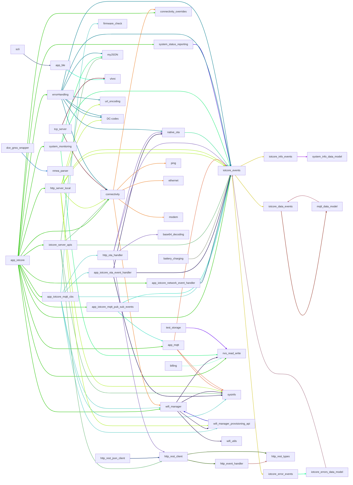

```mermaid
flowchart LR
    app_iotcore --> iotcore_events
    linkStyle 0 stroke:#25c301,stroke-width:2px;
    app_iotcore --> system_monitoring
    linkStyle 1 stroke:#25c301,stroke-width:2px;
    app_iotcore --> system_status_reporting
    linkStyle 2 stroke:#25c301,stroke-width:2px;
    app_iotcore --> errorHandling
    linkStyle 3 stroke:#25c301,stroke-width:2px;
    app_iotcore --> nvs_read_write
    linkStyle 4 stroke:#25c301,stroke-width:2px;
    app_iotcore --> connectivity
    linkStyle 5 stroke:#25c301,stroke-width:2px;
    app_iotcore --> connectivity_overrides
    linkStyle 6 stroke:#25c301,stroke-width:2px;
    app_iotcore --> app_mqtt
    linkStyle 7 stroke:#25c301,stroke-width:2px;
    app_iotcore --> app_iotcore_mqtt_pub_sub_events
    linkStyle 8 stroke:#25c301,stroke-width:2px;
    app_iotcore --> iotcore_server_apis
    linkStyle 9 stroke:#25c301,stroke-width:2px;
    app_iotcore --> app_iotcore_mqtt_cbs
    linkStyle 10 stroke:#25c301,stroke-width:2px;
    app_iotcore --> app_iotcore_network_event_handler
    linkStyle 11 stroke:#25c301,stroke-width:2px;
    app_iotcore --> http_server_local
    linkStyle 12 stroke:#25c301,stroke-width:2px;
    app_iotcore --> wifi_manager
    linkStyle 13 stroke:#25c301,stroke-width:2px;
    app_iotcore_mqtt_cbs --> sysinfo
    linkStyle 14 stroke:#55cbc4,stroke-width:2px;
    app_iotcore_mqtt_cbs --> iotcore_events
    linkStyle 15 stroke:#55cbc4,stroke-width:2px;
    app_iotcore_mqtt_cbs --> firmware_check
    linkStyle 16 stroke:#55cbc4,stroke-width:2px;
    app_iotcore_mqtt_cbs --> http_ota_handler
    linkStyle 17 stroke:#55cbc4,stroke-width:2px;
    app_iotcore_mqtt_cbs --> app_iotcore_ota_event_handler
    linkStyle 18 stroke:#55cbc4,stroke-width:2px;
    app_iotcore_mqtt_cbs --> wifi_manager
    linkStyle 19 stroke:#55cbc4,stroke-width:2px;
    app_iotcore_mqtt_cbs --> wifi_manager_provisioning_api
    linkStyle 20 stroke:#55cbc4,stroke-width:2px;
    app_iotcore_mqtt_pub_sub_events --> app_mqtt
    linkStyle 21 stroke:#30ddc0,stroke-width:2px;
    app_iotcore_mqtt_pub_sub_events --> iotcore_events
    linkStyle 22 stroke:#30ddc0,stroke-width:2px;
    app_iotcore_network_event_handler --> iotcore_events
    linkStyle 23 stroke:#064774,stroke-width:2px;
    app_iotcore_ota_event_handler --> iotcore_events
    linkStyle 24 stroke:#140350,stroke-width:2px;
    app_iotcore_ota_event_handler --> sysinfo
    linkStyle 25 stroke:#140350,stroke-width:2px;
    app_iotcore_ota_event_handler --> native_ota
    linkStyle 26 stroke:#140350,stroke-width:2px;
    battery_charging --> iotcore_events
    linkStyle 27 stroke:#909680,stroke-width:2px;
    billing --> nvs_read_write
    linkStyle 28 stroke:#8efdd1,stroke-width:2px;
    mqtt_data_model --> iotcore_data_events
    linkStyle 29 stroke:#bb7082,stroke-width:2px;
    iotcore_data_events --> mqtt_data_model
    linkStyle 30 stroke:#973729,stroke-width:2px;
    iotcore_error_events --> iotcore_errors_data_model
    linkStyle 31 stroke:#03fc8d,stroke-width:2px;
    iotcore_info_events --> system_info_data_model
    linkStyle 32 stroke:#9f23e0,stroke-width:2px;
    iotcore_events --> iotcore_info_events
    linkStyle 33 stroke:#d4c82f,stroke-width:2px;
    iotcore_events --> iotcore_error_events
    linkStyle 34 stroke:#d4c82f,stroke-width:2px;
    iotcore_events --> iotcore_data_events
    linkStyle 35 stroke:#d4c82f,stroke-width:2px;
    iotcore_server_apis --> myJSON
    linkStyle 36 stroke:#67b675,stroke-width:2px;
    iotcore_server_apis --> iotcore_events
    linkStyle 37 stroke:#67b675,stroke-width:2px;
    iotcore_server_apis --> connectivity
    linkStyle 38 stroke:#67b675,stroke-width:2px;
    iotcore_server_apis --> http_rest_client
    linkStyle 39 stroke:#67b675,stroke-width:2px;
    iotcore_server_apis --> sysinfo
    linkStyle 40 stroke:#67b675,stroke-width:2px;
    app_ble --> vhmi
    linkStyle 41 stroke:#17f3b3,stroke-width:2px;
    scli --> app_ble
    linkStyle 42 stroke:#536192,stroke-width:2px;
    connectivity --> connectivity_overrides
    linkStyle 43 stroke:#ed8731,stroke-width:2px;
    connectivity --> ping
    linkStyle 44 stroke:#ed8731,stroke-width:2px;
    connectivity --> wifi_manager
    linkStyle 45 stroke:#ed8731,stroke-width:2px;
    connectivity --> ethernet
    linkStyle 46 stroke:#ed8731,stroke-width:2px;
    connectivity --> modem
    linkStyle 47 stroke:#ed8731,stroke-width:2px;
    dce_gnss_wrapper --> nmea_parser
    linkStyle 48 stroke:#2078cb,stroke-width:2px;
    wifi_manager --> wifi_manager_provisioning_api
    linkStyle 49 stroke:#331c5a,stroke-width:2px;
    wifi_manager --> sysinfo
    linkStyle 50 stroke:#331c5a,stroke-width:2px;
    wifi_manager --> nvs_read_write
    linkStyle 51 stroke:#331c5a,stroke-width:2px;
    wifi_manager --> wifi_utils
    linkStyle 52 stroke:#331c5a,stroke-width:2px;
    wifi_manager_provisioning_api --> wifi_manager
    linkStyle 53 stroke:#2719c8,stroke-width:2px;
    http_event_handler --> http_rest_types
    linkStyle 54 stroke:#b4615c,stroke-width:2px;
    http_rest_client --> http_rest_types
    linkStyle 55 stroke:#36640f,stroke-width:2px;
    http_rest_client --> http_event_handler
    linkStyle 56 stroke:#36640f,stroke-width:2px;
    http_rest_json_client --> http_rest_client
    linkStyle 57 stroke:#1e417f,stroke-width:2px;
    http_server_local --> connectivity
    linkStyle 58 stroke:#acee20,stroke-width:2px;
    http_server_local --> iotcore_events
    linkStyle 59 stroke:#acee20,stroke-width:2px;
    http_server_local --> iotcore_events
    linkStyle 60 stroke:#acee20,stroke-width:2px;
    http_server_local --> url_encoding
    linkStyle 61 stroke:#acee20,stroke-width:2px;
    http_server_local --> DC-codes
    linkStyle 62 stroke:#acee20,stroke-width:2px;
    http_server_local --> wifi_manager_provisioning_api
    linkStyle 63 stroke:#acee20,stroke-width:2px;
    http_server_local --> sysinfo
    linkStyle 64 stroke:#acee20,stroke-width:2px;
    app_mqtt --> sysinfo
    linkStyle 65 stroke:#e37952,stroke-width:2px;
    app_mqtt --> iotcore_events
    linkStyle 66 stroke:#e37952,stroke-width:2px;
    app_mqtt --> sysinfo
    linkStyle 67 stroke:#e37952,stroke-width:2px;
    tcp_server --> connectivity
    linkStyle 68 stroke:#6d0d20,stroke-width:2px;
    tcp_server --> vhmi
    linkStyle 69 stroke:#6d0d20,stroke-width:2px;
    http_ota_handler --> native_ota
    linkStyle 70 stroke:#8061bb,stroke-width:2px;
    http_ota_handler --> http_rest_client
    linkStyle 71 stroke:#8061bb,stroke-width:2px;
    http_ota_handler --> base64_decoding
    linkStyle 72 stroke:#8061bb,stroke-width:2px;
    http_ota_handler --> iotcore_events
    linkStyle 73 stroke:#8061bb,stroke-width:2px;
    native_ota --> iotcore_events
    linkStyle 74 stroke:#34dc91,stroke-width:2px;
    system_monitoring --> iotcore_events
    linkStyle 75 stroke:#1fed77,stroke-width:2px;
    system_monitoring --> nvs_read_write
    linkStyle 76 stroke:#1fed77,stroke-width:2px;
    system_monitoring --> myJSON
    linkStyle 77 stroke:#1fed77,stroke-width:2px;
    system_status_reporting --> iotcore_events
    linkStyle 78 stroke:#3d0ad6,stroke-width:2px;
    test_storage --> nvs_read_write
    linkStyle 79 stroke:#6f12f2,stroke-width:2px;
    iotcore_errors_data_model --> iotcore_events
    linkStyle 80 stroke:#ac7a8d,stroke-width:2px;
    errorHandling --> connectivity
    linkStyle 81 stroke:#087e90,stroke-width:2px;
    errorHandling --> iotcore_events
    linkStyle 82 stroke:#087e90,stroke-width:2px;
    errorHandling --> myJSON
    linkStyle 83 stroke:#087e90,stroke-width:2px;
    errorHandling --> native_ota
    linkStyle 84 stroke:#087e90,stroke-width:2px;
    errorHandling --> url_encoding
    linkStyle 85 stroke:#087e90,stroke-width:2px;
    errorHandling --> DC-codes
    linkStyle 86 stroke:#087e90,stroke-width:2px;
    errorHandling --> DC-codes
    linkStyle 87 stroke:#087e90,stroke-width:2px;
    errorHandling --> iotcore_events
    linkStyle 88 stroke:#087e90,stroke-width:2px;
```
