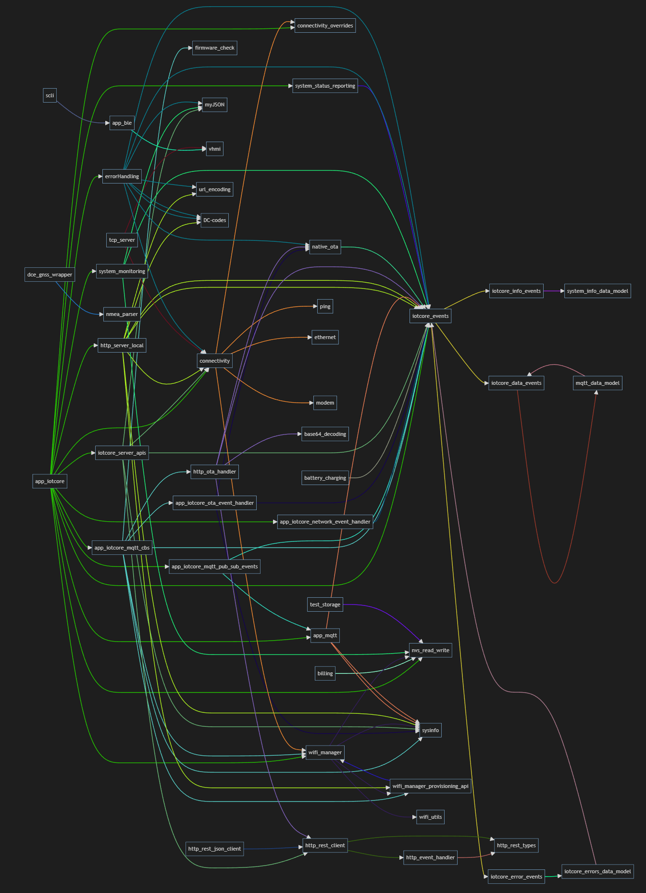

# Welcome to Iotcore's documentation!


## Introduction

Iotcore(embedded) is a library written for esp32 series of microcontrollers and provide them with an interface which
sets up most of the required features for an iot device, namely

1. connectivity
2. server registration
3. communication
4. communication with hardware sensors
5. over the air updates

The purpose of this library is to give all these to the user prebaked and only leave integration of specifica sensor or application to the user.
The library also helps the user in ahcieving that by incorporating hardware interface initialization drivers and code for various sensors and devices.
The user only needs to call init functions for things to get goind.

## Getting Started

In order to get started with iotcore you will need to add it in an esp-idf project and add dependency in CMakeLists.txt

These are the steps to achieve that.

### Steps

1. Setup idf project.
a. Use [idf extension](https://github.com/espressif/vscode-esp-idf-extension)
b. Use [npx](https://github.com/Mair/create-esp32-app)
2. Add iotcore to the components directory of the project
`git clone https://gitlab.com/cowlar/embedded/cowlar-iot-core-esp32.git components/iotcore`
3. Update CMakeLists.txt to include iotcore as a dependency

```
idf_component_register(SRCS "main.c"
                        INCLUDE_DIRS "./" 
                        REQUIRES "iotcore"
                        )
```

4. Include and use iotcore in `main.c` file

```
char clientID[30];
#include "app_iotcore.h"
void app_main() {
    init_iotcore(NULL);
}
```

This is all the boilerplate the you should need to get started with iotcore.

## Dependency graph

### Generation

1. `python -m codeviz -r ./ --ignore=hardware/\*\*/\*.\* --ignore=output\_devices/\*\*/\*.\*`
2. `python .\dependency\_graph\_generator.py`

