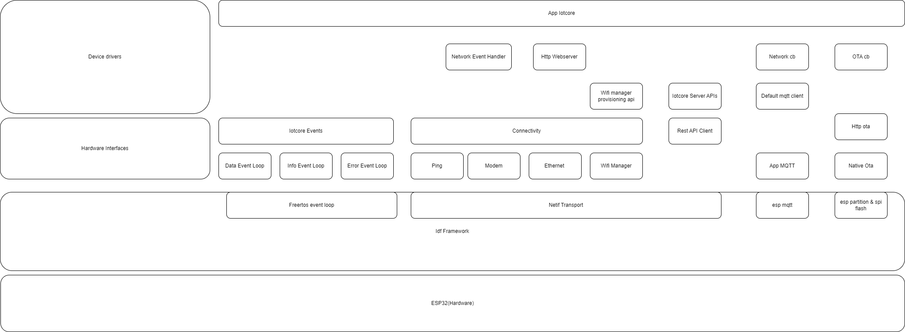

# App Iotcore

App iotcore is the part of iotcore that includes all that is needed for the device to communicate with server side. This is true as of 10/1/23 after that ask the people with next commits

This implements features for runtime statistics gathering, error collection, communication setup, device onboarding, network communication, and over the air updates.

App iotcore itself is just a wrapper to the modules for all of the below defined and uses them to provide all this functionality.

Here is how app iotcore lies above all the modules



Understanding of underlying modules will help in understanding how app_iotcore functionality. For the purpose of app_iotcore the only configuration required if 

```
    CONFIG_ENABLE_NVS=y
    CONFIG_REST_API_CLIENT=y
    CONFIG_ENABLE_IOTCORE_SERVER_API=y
    CONFIG_ENABLE_IOTCORE_EVENTS=y

    CONFIG_IOTCORE_COMMS_EVENT_HEAP_SIZE=4096
    CONFIG_IOTCORE_APP_EVENT_HEAP_SIZE=4096
    CONFIG_IOTCORE_ERROR_EVENT_HEAP_SIZE=4096

    CONFIG_ENABLE_OTA=y
    CONFIG_HEAP_POISONING_COMPREHENSIVE=y
    CONFIG_STACK_CHECK_STRONG=y

    ###size of app will increase so partition table will be needed

    CONFIG_ESPTOOLPY_FLASHSIZE_4MB=y
    CONFIG_ESPTOOLPY_FLASHSIZE="4MB"
    #
    # Partition Table
    #
    # CONFIG_PARTITION_TABLE_SINGLE_APP is not set
    # CONFIG_PARTITION_TABLE_SINGLE_APP_LARGE is not set
    # CONFIG_PARTITION_TABLE_TWO_OTA is not set
    CONFIG_PARTITION_TABLE_CUSTOM=y
    CONFIG_PARTITION_TABLE_CUSTOM_FILENAME="partitions.csv"
    CONFIG_PARTITION_TABLE_FILENAME="partitions.csv"
    CONFIG_PARTITION_TABLE_OFFSET=0x8000
    CONFIG_PARTITION_TABLE_MD5=y
    # end of Partition Table


    #if need app_iotcore to handle onboarding add this part

    CONFIG_IOTCORE_SERVER_API_DEFAULT_CONFIG=y
    CONFIG_IOTCORE_SERVER_API_DEFAULT_CONFIG_URL="https://api.iotcore.cowlar.com"
    CONFIG_IOTCORE_SERVER_API_DEFAULT_CONFIG_USERNAME="device.sim-dispenser@cowlar.com"
    CONFIG_IOTCORE_SERVER_API_DEFAULT_CONFIG_PASSWORD="123456"

    #if need default mqtt client and post message with events use this

    CONFIG_IOTCORE_MQTT_DEFAULT_CLIENT_TRANSPORT="mqtt"
    CONFIG_IOTCORE_MQTT_DEFAULT_USERNAME="dockersim-dispenser"
    CONFIG_IOTCORE_MQTT_DEFAULT_PASSWORD="CowlarGeyser7890"
    CONFIG_IOTCORE_MQTT_DEFAULT_HOST="iotcore.cowlar.com"
    CONFIG_IOTCORE_MQTT_DEFAULT_PORT="1883"
```

Some of these are optional and disable some functionality provided by app_iotcore.
Inclusion of this library will for sure increase flash size and you will need to use partition table. given below is the recommended partition entry

```
    #contents of partitions.csv

    #####    # Name,   Type, SubType, Offset,  Size, Flags
    #####    # Note: if you have increased the bootloader size, make sure to update the offsets to avoid overlap
    #####    nvs,        data,    nvs,      0x9000,  0x4000,
    #####    otadata,    data,    ota,      0xd000,  0x2000,
    #####    phy_init,   data,    phy,      0xf000,  0x1000,
    #####    ota_0,       app,  ota_0,     0x10000,   1536K,
    #####    ota_1,       app,  ota_1,            ,   1536K,
```

Files explanation

1. app_iotcore_mqtt_cbs

    For it's functionality like state/error reporting and ota updates the library relies on mqtt messages. This file handles all the topics that have been subscribed by app_iotcore. 

2. app_iotcore_mqtt_pub_pub_events
    
    MQTT library's communication is wrapped with events to make it possible for application to send messages through mqtt without needing to include all dependencies. 

    This part of the code is the actual handler that will recieve the events and make proper usage of the mqtt library to make sure message gets transmitted or a topic is subscribed

3. app_iotcore_network_event_handler

    This file makes sure that whenever a change in network event is observed it gets reported to the server

4. app_iotcore_ota_event_handler

    Native ota posts events for updates which get handled here to let the server know if the ota was successful or did it fail. Also monitors progress events.

