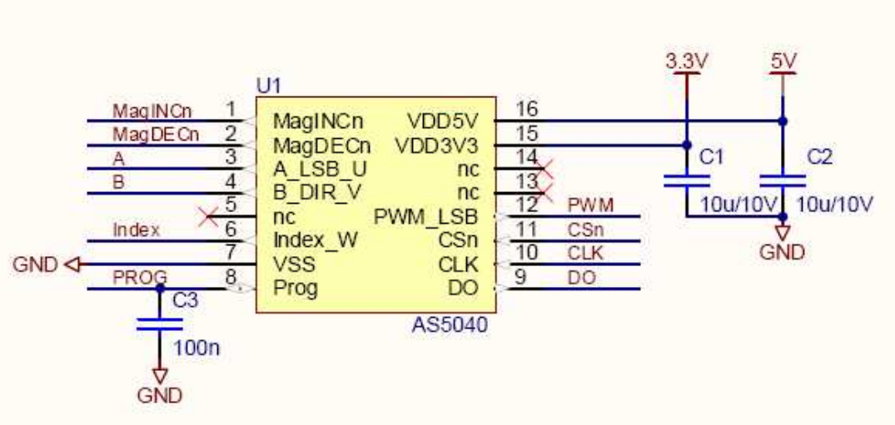
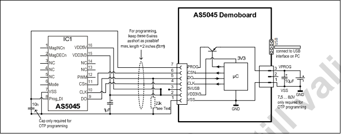

# Description
The AS5045 is a contactless magnetic rotary encoder
for accurate angular measurement over a full turn of
360°. To measure the angle, only a simple two-pole magnet,
rotating over the center of the chip, is required. The
magnet may be placed above or below the IC.
The absolute angle measurement provides instant
indication of the magnet’s angular position with a
resolution of 0.0879° positions per revolution.
This digital data is available as a serial bit stream and
as a PWM signal. An internal voltage regulator allows the AS5045 to
operate at either 3.3 V or 5 V supplies.
# Basic circuit diagram

# Programming mode circuit

The programming logic level is higher then IC voltage input around 7.5 ~ 8.0V.

For more information on the device please consult the [datasheet](https://ams.com/documents/20143/36005/AS5045_DS000101_3-00.pdf).